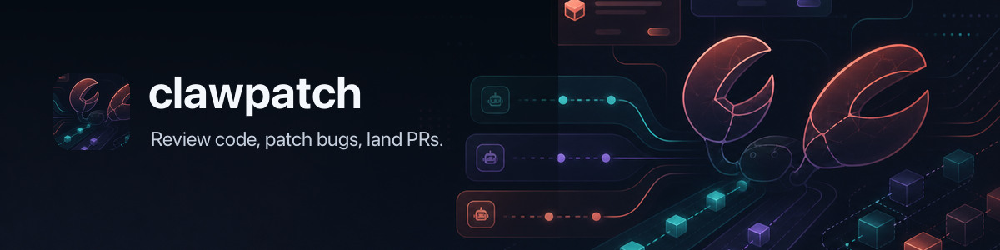

# clawpatch 🩹 — Review by feature, fix by finding.



[](https://github.com/openclaw/clawpatch/actions/workflows/ci.yml)
[](https://www.npmjs.com/package/clawpatch)
[](https://nodejs.org/)
[](LICENSE)

Clawpatch maps a repository into semantic feature slices, asks an installed coding agent to review each slice, and stores evidence-backed findings for later repair. It is for maintainers who want review, patching, and revalidation to stay explicit and resumable.

## Install

```sh
pnpm add -g clawpatch
```

Or with npm:

```sh
npm install -g clawpatch
```

Clawpatch requires Node.js 22 or newer.

## Quick start

Start in a Git repository:

```sh
cd /path/to/repository
clawpatch init
clawpatch map
clawpatch status
```

Initialization creates project-local state under `.clawpatch/`. The default mapper inspects repository structure without calling a model.

With a [supported coding agent](docs/providers.md) installed and authenticated, run the first review:

```sh
clawpatch doctor
clawpatch review --limit 3
clawpatch report
```

Review progress goes to stderr. Findings and run records remain under `.clawpatch/`, so interrupted work can resume without starting over.

## Workflow

| Stage      | Command                               | Result                                                                   |
| ---------- | ------------------------------------- | ------------------------------------------------------------------------ |
| Initialize | `clawpatch init`                      | Detect the project and write configuration.                              |
| Map        | `clawpatch map`                       | Create durable semantic feature records.                                 |
| Review     | `clawpatch review`                    | Run bounded, parallel reviews and persist findings.                      |
| Inspect    | `clawpatch next`, `show`, `report`    | Prioritize and examine evidence.                                         |
| Repair     | `clawpatch fix --finding <id>`        | Apply one explicit patch attempt and run configured validation.          |
| Confirm    | `clawpatch revalidate --finding <id>` | Re-check the finding against the current code.                           |
| Publish    | `clawpatch open-pr --patch <id>`      | Commit the recorded patch files, push a branch, and open a pull request. |

Use `clawpatch ci --since origin/main --output clawpatch-report.md` for the source-read-only init, map, review, and report loop in CI. The [quickstart](docs/quickstart.md) walks through the full workflow, and the [code-review guide](docs/code-review.md) covers selection, concurrency, rate limits, and diff-scoped review.

## Feature mapping

Clawpatch detects reviewable boundaries across Node.js and TypeScript, Python, Ruby, PHP, Go, Rust, C and C++, Java and Kotlin, .NET, and Swift projects. Mappers use manifests, framework conventions, routes, packages, targets, tests, and nearby context; generated directories and symlinked directories are skipped.

Mapping is deterministic by default. `--source auto` and `--source agent` can add provider-assisted slices when the repository needs deeper interpretation. See [Feature Mapping](docs/feature-mapping.md) for supported project shapes and known gaps.

## Providers

The default provider is the local Codex CLI. Clawpatch also integrates ACP-compatible agents through ACPX and has adapters for Claude Code, Grok Build, OpenCode, Pi, and an experimental Cursor Agent path.

Providers are installed coding harnesses or agent CLIs; Clawpatch does not call model APIs directly. Authentication, model transport, and agent execution remain with the selected harness. See [Providers](docs/providers.md) for setup, model selection, permissions, and isolation details, and [VISION.md](VISION.md) for the project boundary.

## State and configuration

Clawpatch stores configuration, feature records, findings, patch attempts, reports, and run history under `.clawpatch/`. Commands that support `--json` keep machine-readable results on stdout and send human progress to stderr.

Configuration can set include and exclude paths, provider defaults, context limits, and validation commands. Start with [Configuration](docs/configuration.md), then use the focused guides for [findings](docs/findings.md), [patching](docs/patching.md), [reporting](docs/reporting.md), and [validation](docs/validation.md).

## Safety

Clawpatch requests read-only provider execution for review and revalidation. `fix` requires a finding ID, refuses a dirty source worktree by default, records changed files and validation results, and does not commit or push. Creating a commit and pull request requires the separate `open-pr` command; Clawpatch does not merge changes.

Provider sandboxes and tool restrictions differ. Read [Safety](docs/safety.md) before using write-capable providers on untrusted code.

## Development

```sh
pnpm install
pnpm typecheck
pnpm lint
pnpm format:check
pnpm test
pnpm build
pnpm pack:smoke
```

Use Node.js 22 or newer and the pnpm version declared in `package.json`.

## License

[MIT](LICENSE)
